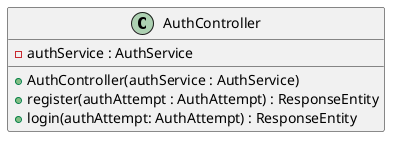
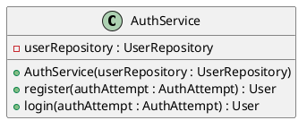
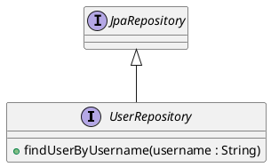

# Class diagram

## Controller

```plantuml
@startuml

class AuthController {
	- authService : AuthService

	+ AuthController(authService : AuthService)
	+ register(authAttempt : AuthAttempt) : ResponseEntity
	+ login(authAttempt: AuthAttempt) : ResponseEntity
}

@enduml
```

## Service

```plantuml
@startuml

class AuthService {
	- userRepository : UserRepository

	+ AuthService(userRepository : UserRepository)
	+ register(authAttempt : AuthAttempt) : User
	+ login(authAttempt : AuthAttempt) : User
}

@enduml
```

## Repository

```plantuml
@startuml

interface UserRepository extends JpaRepository {
	+ findUserByUsername(username : String)
}

@enduml
```
