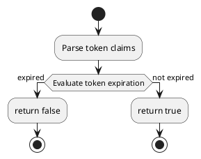
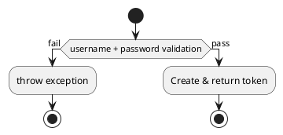
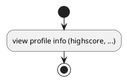
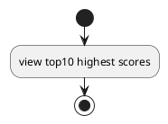
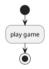

# Flowchart diagrams

<!-- ================================================================================================= -->

<!-- ## validateToken

<!-- ================================================================================================= -->

## log in

<!-- ================================================================================================= -->

## view profile

<!-- ================================================================================================= -->

## view leaderboard

<!-- ================================================================================================= -->

## play game

