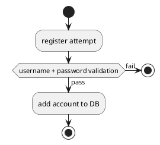
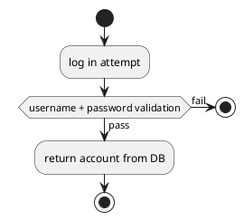

# Flowchart diagrams

## register

```plantuml
@startuml
start

:register attempt;
if (username + password validation) then (fail)
stop
else(pass)

:add account to DB;

stop
@enduml
```

## log in

```plantuml
@startuml
start

:log in attempt;
if (username + password validation) then (fail)
stop
else(pass)

:return account from DB;

stop
@enduml
```
