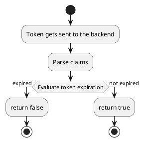
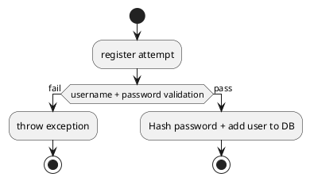
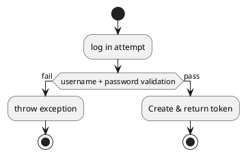

# Flowchart diagrams

<!-- ================================================================================================= -->

## validateToken

<!-- ================================================================================================= -->

## register

<!-- ================================================================================================= -->

## log in

