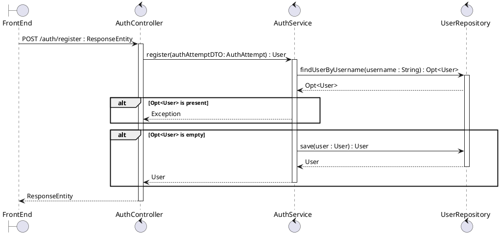
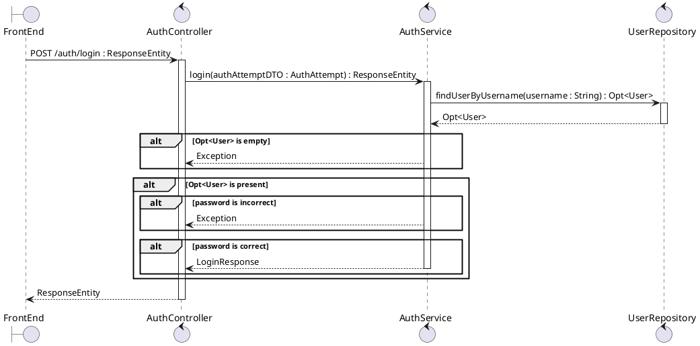

# Sequence Diagram

## register

```plantuml
@startuml
Boundary FrontEnd as frontend
Control AuthController as authcontroller
Control AuthService as authservice
Control UserRepository as userrepository

frontend -> authcontroller : POST /auth/register : ResponseEntity
activate authcontroller

authcontroller -> authservice : register(authAttemptDTO: AuthAttempt) : User
activate authservice

authservice -> userrepository : findUserByUsername(username : String) : Opt<User>
activate userrepository

userrepository --> authservice : Opt<User>

alt Opt<User> is present
authservice --> authcontroller : Exception
end

alt Opt<User> is empty
authservice -> userrepository : save(user : User) : User

userrepository --> authservice : User
deactivate userrepository

authservice --> authcontroller : User
deactivate authservice
end

authcontroller --> frontend : ResponseEntity
deactivate authcontroller

@enduml
```

<!-- ============================================================ -->

## login

```plantuml
@startuml
Boundary FrontEnd as frontend
Control AuthController as authcontroller
Control AuthService as authservice
Control UserRepository as userrepository

frontend -> authcontroller : POST /auth/login : ResponseEntity
activate authcontroller

authcontroller -> authservice : login(authAttemptDTO : AuthAttempt) : ResponseEntity
activate authservice


authservice -> userrepository : findUserByUsername(username : String) : Opt<User>
activate userrepository

userrepository --> authservice : Opt<User>
deactivate userrepository

alt Opt<User> is empty
authservice --> authcontroller : Exception
end

alt Opt<User> is present
	alt	password is incorrect
	authservice --> authcontroller : Exception
	end

	alt password is correct
	authservice --> authcontroller : LoginResponse
	deactivate authservice
	end
end

authcontroller --> frontend : ResponseEntity
deactivate authcontroller

@enduml
```
