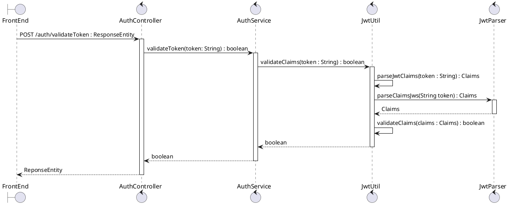
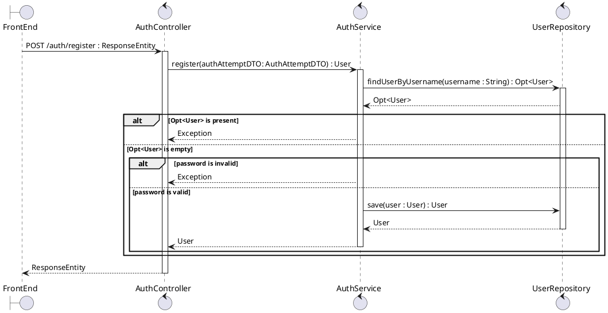
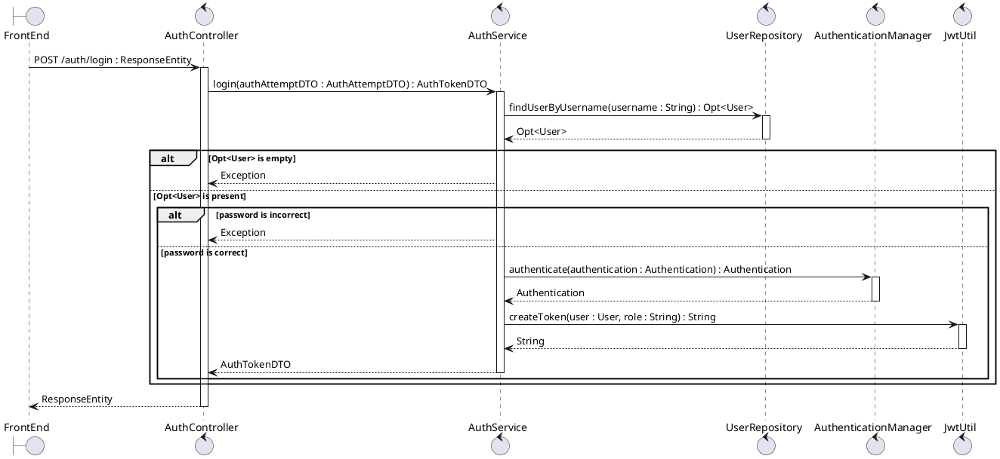

# Sequence Diagram

<!-- ================================================================================================= -->

## validateToken

<!-- ================================================================================================= -->

## register

<!-- ============================================================ -->

## login

