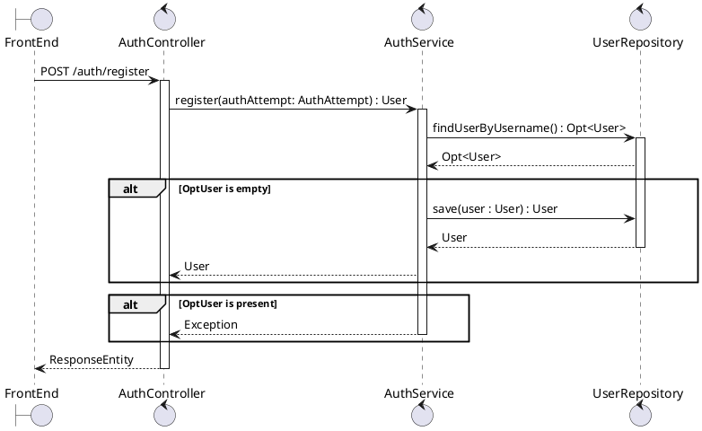

# Sequence Diagram

## register


```plantuml
@startuml
Boundary FrontEnd as frontend
Control AuthController as authcontroller
Control AuthService as authservice
Control UserRepository as userrepository

frontend -> authcontroller : POST /auth/register
activate authcontroller

authcontroller -> authservice : register(authAttempt: AuthAttempt) : User
activate authservice

authservice -> userrepository : findUserByUsername() : Opt<User>
activate userrepository

userrepository --> authservice : Opt<User>

alt OptUser is empty
authservice -> userrepository : save(user : User) : User

userrepository --> authservice : User
deactivate userrepository

authservice --> authcontroller : User
end

alt OptUser is present
authservice --> authcontroller : Exception
deactivate authservice
end

authcontroller --> frontend : ResponseEntity
deactivate authcontroller

@enduml
```

<!-- ============================================================ -->

<!-- ## login

```plantuml
@startuml

test

@enduml
``` -->
