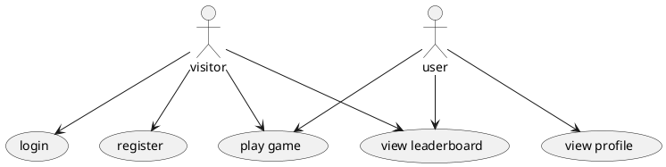

```plantuml
@startuml

' actors
:visitor: as visitor
:user: as user

' functionalities
(register) as register
(login) as login
(view leaderboard) as "view leaderboard"
(play game) as "play game"
(view profile) as "view profile"

' relations
visitor --> register
visitor --> login
visitor --> "play game"
visitor --> "view leaderboard"
user --> "play game"
user --> "view leaderboard"
user --> "view profile"

@enduml
```
